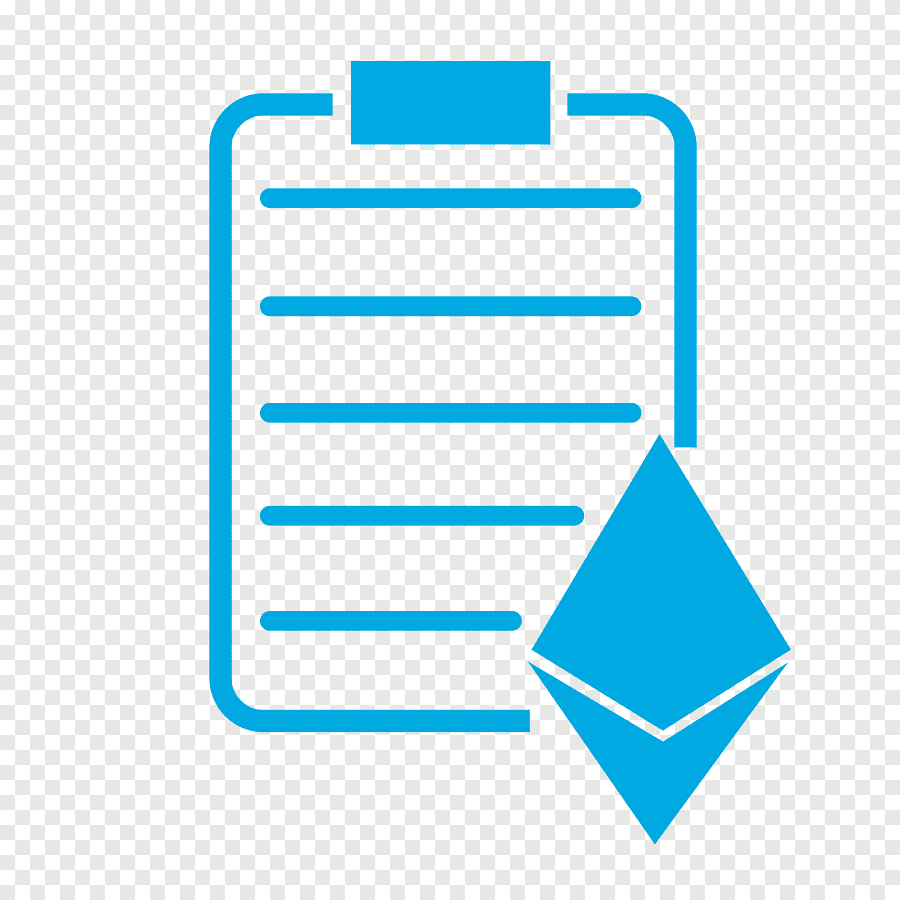

<div id="top"></div>


<!-- PROJECT LOGO -->
<br />
<div align="center">
  <a>
    
  </a>

  <h3 align="center">Smart contracts using AWS Blockchain templates</h3>

</div>


<!-- TABLE OF CONTENTS -->
<details>
  <summary>Table of Contents</summary>
  <ol>
    <li>
      <a href="#about-the-project">About The Project</a>
      <ul>
        <li><a href="#built-with">Built With</a></li>
      </ul>
    </li>
    <li>
      <a href="#getting-started">Getting Started</a>
      <ul>
        <li><a href="#prerequisites">Prerequisites</a></li>
        <li><a href="#installation">Installation</a></li>
      </ul>
    </li>
    <li><a href="#usage">Usage</a></li>
    <li><a href="#contact">Contact</a></li>
  </ol>
</details>


<!-- ABOUT THE PROJECT -->
## About The Project

Client-server applications dominated the software development landscape. Despite the advancements in technologies and architecture, the fundamental model remained the same. In this repo, I've developed Applications on Ethereum Blockchain, which is decentralized applications of Ethereum.

Topics I implemented:
* Time in Smart Contracts	
* Enums & Ether Units
* Function Modifiers
* Contracts Inheritance
* Events
* Contracts Interaction
* Implementing Librarires in solidity


<p align="right">(<a href="#top">back to top</a>)</p>


### Built With

This section should list any major frameworks/libraries used to bootstrap your project. Leave any add-ons/plugins for the acknowledgements section. Here are a few examples.

* [AWS](https://aws.amazon.com//)
* [Ethereum](https://ethereum.org/en/)
* [Solidity](https://docs.soliditylang.org/en/v0.8.10/)
* [Blockchain template](https://docs.aws.amazon.com/blockchain-templates/)

<p align="right">(<a href="#top">back to top</a>)</p>


<!-- GETTING STARTED -->
## Getting Started

Ethereum is a platform for developing applications. It is based on the Blockchain technology, and we can build applications on top of this such as payments, domain name systems, financial applications, and many, many more. In the nutshell, Blockchain is just a chain of blocks. Every block can take a list of transactions that happened in this block, and all blocks are connected into a chain. So the next block is always pointing to a previous block and so on, until we get to the first block that also is called Genesis block.

### Prerequisites

1. Install node js for implementing the code.
2. Learn Solidity programming for getting started.

### Installation

_Below is an example of how you can instal and set up your environment._

1. Get a online Remix IDE from [remix. ethereum. org](remix. ethereum. org)
2. Install NPM packages
   ```sh
   npm install
   ```

<p align="right">(<a href="#top">back to top</a>)</p>


<!-- USAGE EXAMPLES -->
## Usage

Smart contracts are simply programs stored on a blockchain that run when predetermined conditions are met. They typically are used to automate the execution of an agreement so that all participants can be immediately certain of the outcome, without any intermediary's involvement or time loss. Digital Identity. One of the most obvious smart contract use cases is Digital Identity. Individual identity is one of the biggest assets for that individual. It contains reputation, data, and digital assets.

<p align="right">(<a href="#top">back to top</a>)</p>


<!-- CONTACT -->
## Contact
<br/>

> ### <center> __*Yaseen Shaik*__ </center>
>
> - Email ID  - yaseenshaik00@gmail.com
> - Linkedin  - [www.linkedin.com/in/yaseenshaik00](www.linkedin.com/in/yaseenshaik00)
> - Twitter   - [https://twitter.com/yaseenshaik00](https://twitter.com/yaseenshaik00)
> - Github    - [https://github.com/yaseenshaik00](https://github.com/yaseenshaik00)
>  


<p align="right">(<a href="#top">back to top</a>)</p>

